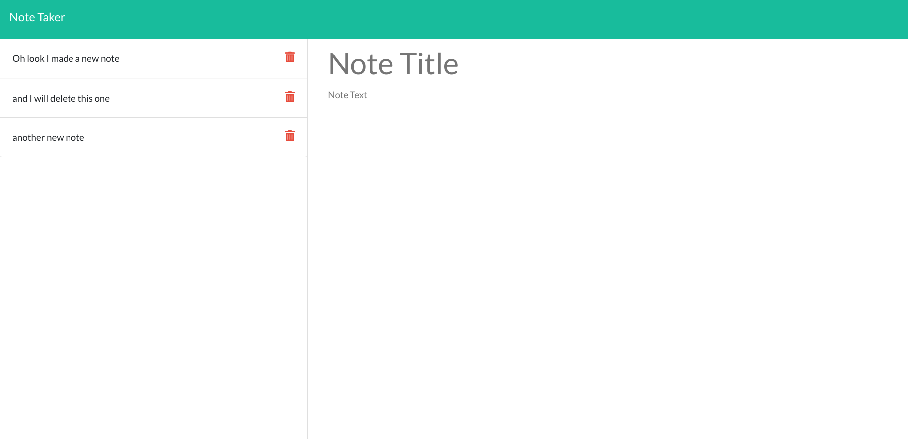
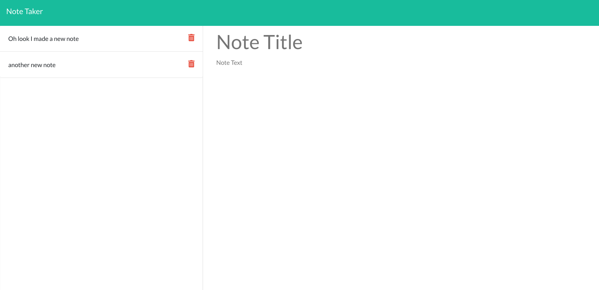

# Note Taker Starter Code
  ## Table of Contents
  * [Description](#description)
  * [Installation](#installation)
  * [Screenshot](#screenshot)
  * [Questions](#questions)

  ## Description

This is a note taker app made with express.js. It can take notes and save notes and delete notes.

  ## Installation

  To install run npm i.

  ## Screenshot
  Here is a screenshot after I added notes.

  
  Here is a screenshot after deleting one note
  

  ## Questions
  
  If you have any questions please check out [my github](https://github.com/Naomilounsbury/pizza-space-note-taker) 